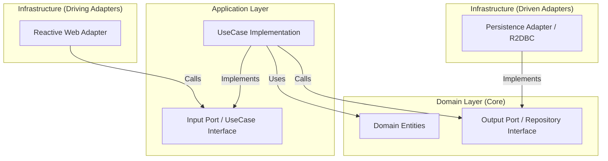

# University Registration API

-----

## Table of Contents

1.  [Project Manifesto](https://www.google.com/search?q=%231-project-manifesto)
2.  [Guiding Principles](https://www.google.com/search?q=%232-guiding-principles)
3.  [Architectural Deep Dive](https://www.google.com/search?q=%233-architectural-deep-dive)
4.  [Technology Stack](https://www.google.com/search?q=%234-technology-stack)
5.  [API Reference](https://www.google.com/search?q=%235-api-reference)
6.  [Database Schema](https://www.google.com/search?q=%236-database-schema)
7.  [Getting Started](https://www.google.com/search?q=%237-getting-started)
8.  [Author](https://www.google.com/search?q=%238-author)

-----

## 1\. Project Manifesto

This project is more than a simple API; it is a **reference architecture** and a statement on modern software engineering. It is meticulously crafted to serve as a blueprint for building high-performance, scalable, and maintainable enterprise-level applications in Java.

The **University Registration API** embodies a philosophy of clean architecture, uncompromising performance, and developer-centric design. Every line of code, every dependency, and every design pattern has been deliberately chosen to create a system that is not only functional but also elegant, robust, and a pleasure to maintain.

-----

## 2\. Guiding Principles

This application is built upon a foundation of non-negotiable engineering principles.

### 2.1. Architectural Purity: The Hexagonal Model

The system is designed using the **Hexagonal (Ports & Adapters) Architecture**. This paradigm creates a powerful separation between the application's core logic and its external concerns (like web frameworks or databases), resulting in a highly modular and technology-agnostic domain.

### 2.2. Uncompromising Reactivity: An End-to-End Non-Blocking Stack

The entire application stack is **100% reactive**. From the moment a request hits the `WebFlux` entry point to the final `R2DBC` database query, the execution is fully non-blocking. This guarantees optimal resource utilization, superior scalability under load, and a more resilient system.

### 2.3. Guaranteed Performance: The BlockHound Mandate

To enforce our commitment to a non-blocking stack, the project integrates **BlockHound**. This tool is configured in the test suite to automatically detect and **fail any build** that introduces blocking I/O calls. This provides a powerful, automated guarantee that the reactive principles of the application are never violated.

### 2.4. Functional & Declarative API Design

The API is defined using Spring WebFlux's **functional routing model** (`RouterFunction`). This declarative, code-centric approach was chosen over traditional annotations to provide a centralized, immutable, and highly readable definition of the API's surface area, perfectly aligning with the functional nature of the reactive handlers.

### 2.5. Immutability by Default

The project heavily leverages Java `record` types for DTOs and domain models. This enforces **immutability**, which simplifies development by eliminating side effects, ensuring thread safety, and making the system's state more predictable and easier to reason about.

-----

## 3\. Architectural Deep Dive

The architecture follows a strict separation of concerns. Below is the high-level flow and the physical structure of the project.

### 3.1. Architecture Diagram



### 3.2. Project Structure

```text
src/main/java/com/university/registration
├── domain                 # THE CORE: Pure Java, framework-agnostic
│   ├── model              # Immutable Records (Student, Course...)
│   ├── port
│   │   ├── in             # Input Ports (ISaveStudentUseCase)
│   │   └── out            # Output Ports (IStudentRepository)
│   └── exception          # Domain-specific exceptions
├── application            # THE GLUE: Business logic implementation
│   └── usecase            # Use Cases (SaveStudentUseCase)
└── infrastructure         # THE DETAILS: Frameworks & Drivers
    ├── entry-points       # Driving Adapters (Router, Handler)
    └── driven-adapters    # Driven Adapters (R2DBC Repositories)
```

### 3.3. Module Details

#### `domain` Module

The heart of the application, completely isolated and framework-agnostic.

- **`model`**: Contains the pure business entities (`Student`, `Course`, `Enrollment`, `Period`), implemented as immutable Java `record` types. These represent the core concepts of the university.
- **`port/in/usecase`**: Defines the input ports—Java interfaces that represent the application's capabilities (e.g., `ISaveStudentUseCase`, `IGetAllCoursesUseCase`). These are the only entry points into the application's business logic.
- **`port/out/persistence`**: Defines the output ports—interfaces for data persistence (e.g., `IStudentRepository`, `ICourseRepository`). These abstract away the underlying database technology, allowing it to be swapped with minimal effort.

#### `application` Module

The implementation of the business logic.

- **`use-case`**: Contains the concrete use case implementations. For example, `SaveStudentUseCase` contains the critical business rule logic to validate that a student's DNI and email are unique before persisting the data. A custom `@UseCase` annotation is used to semantically mark these components for clarity and potential AOP integration.

#### `infrastructure` Module

The implementation of the ports, connecting the application to the outside world.

- **`entry-points/reactive-web` (Driving Adapter)**:

    - `router`: `RouterFunction` beans define the API routes, mapping HTTP methods and paths to the appropriate handlers.
    - `handler`: Reactive handlers process incoming `ServerRequest` objects, delegate to the use cases, and build the `ServerResponse`.
    - `dto`: Immutable `record` types for API request and response bodies, validated with `jakarta.validation` and documented with `@Schema` for precise OpenAPI specifications.
    - `mapper`: High-performance, compile-time mappers using **MapStruct** to convert between DTOs and domain models, avoiding the overhead of reflection.

- **`driven-adapters/persistence` (Driven Adapter)**:

    - `adapter`: Implements the persistence ports defined in the domain. A key component here is the generic `ReactiveAdapterOperations` class, which centralizes common mapping logic to keep the adapters clean and DRY.
    - `entity`: Defines the database entities (e.g., `StudentEntity`) with R2DBC mapping annotations.
    - `repository`: Spring Data R2DBC repository interfaces for reactive database queries.

-----

## 4\. Technology Stack

| Category                | Technology                                                              |
| :---------------------- | :---------------------------------------------------------------------- |
| **Framework** | Spring Boot 3.5.4 / Spring WebFlux                                      |
| **Language** | Java 17 (LTS)                                                           |
| **Build Tool** | Gradle 8.14.3                                                           |
| **Reactive Programming**| Project Reactor                                                         |
| **Database** | PostgreSQL (with R2DBC for reactive connectivity)                       |
| **API Documentation** | Springdoc OpenAPI 3.0                                                   |
| **Code Quality** | Lombok, MapStruct                                                       |
| **Testing** | JUnit 5, Reactor Test, BlockHound                                       |

-----

## 5\. API Reference

The API is designed using functional endpoints. Below is a detailed reference of the available resources.

### 5.1. Student API

| Method | Path | Description |
| :--- | :--- | :--- |
| `POST` | `/api/v1/student` | Creates a new student. |
| `GET` | `/api/v1/student` | Retrieves a paginated list of students. |
| `GET` | `/api/v1/student/{id}` | Retrieves a student by their ID. |
| `PUT` | `/api/v1/student/{id}` | Updates an existing student. |
| `GET` | `/api/v1/student/dni/{dni}` | Retrieves a student by their DNI. |
| `GET` | `/api/v1/student/email/{email}` | Retrieves a student by their email. |
| `GET` | `/api/v1/student/name/{name}` | Retrieves a student by their name. |

### 5.2. Course API

| Method | Path | Description |
| :--- | :--- | :--- |
| `POST` | `/api/v1/course` | Creates a new course. |
| `GET` | `/api/v1/course` | Retrieves a paginated list of courses. |
| `GET` | `/api/v1/course/{id}` | Retrieves a course by its ID. |
| `GET` | `/api/v1/course/name/{name}` | Retrieves a course by its name. |

### 5.3. Period API

| Method | Path | Description |
| :--- | :--- | :--- |
| `POST` | `/api/v1/period` | Creates a new academic period. |
| `GET` | `/api/v1/period/{id}` | Retrieves a period by its ID. |
| `GET` | `/api/v1/period/name/{name}` | Retrieves a period by its name. |

### 5.4. Enrollment API

| Method | Path | Description |
| :--- | :--- | :--- |
| `POST` | `/api/v1/enrollment` | Creates a new enrollment. |
| `GET` | `/api/v1/enrollment` | Retrieves a paginated list of enrollments. |
| `GET` | `/api/v1/enrollment/{id}` | Retrieves an enrollment by its ID. |
| `GET` | `/api/v1/enrollment/student/{studentId}` | Retrieves all enrollments for a student. |

-----

## 6\. Database Schema

The application is designed to work with a PostgreSQL database. The following is a high-level overview of the database schema and relationships.

```mermaid
erDiagram
    STUDENT ||--o{ ENROLLMENT : has
    COURSE ||--o{ ENROLLMENT : includes
    PERIOD ||--o{ ENROLLMENT : occurs_in

    STUDENT {
        uuid id PK
        string dni UK
        string email UK
        string name
        ...
    }
    COURSE {
        uuid id PK
        string code UK
        string name
    }
    PERIOD {
        uuid id PK
        string code UK
    }
    ENROLLMENT {
        uuid id PK
        uuid student_id FK
        uuid course_id FK
        uuid period_id FK
        timestamp registered_at
    }
```

- **`students`**: Stores student information (name, DNI, email, etc.).
- **`courses`**: Stores course information (name, code, description).
- **`periods`**: Stores academic periods (e.g., "2023-I", "2023-II").
- **`enrollments`**: A join table that links students, courses, and periods, representing a student's enrollment in a course for a specific period.

-----

## 7\. Getting Started

### 7.1. Prerequisites

- Java 17 SDK
- Docker & Docker Compose (Optional, but recommended for DB)
- A running instance of PostgreSQL.

### 7.2. Database Configuration

**Option A: Docker (Fastest)**
Run the provided compose file to start PostgreSQL immediately.

```bash
docker-compose up -d
```

**Option B: Manual Configuration**
Configure the R2DBC connection to your PostgreSQL database in `application.yml` located at `run/src/main/resources/`.

```yaml
adapters:
  persistence:
    host: your_host
    port: your_port
    database: your_database
    username: your_username
    password: your_password
    schema: your_schema
```

### 7.3. Build and Run

1.  **Build the project:**
    ```bash
    ./gradlew build
    ```
2.  **Run the application:**
    ```bash
    ./gradlew bootRun
    ```
    The API will be available at `http://localhost:8080`.

### 7.4. API Documentation (Swagger UI)

Once running, the interactive OpenAPI documentation is available at:
[http://localhost:8080/swagger-ui.html](https://www.google.com/search?q=http://localhost:8080/swagger-ui.html)

-----

## 8\. Author

- **Allan Sagastegui**
- *Software Developer specialized in Java & Spring Ecosystem*
- Email: [allansagasteguih@gmail.com](mailto:allansagasteguih@gmail.com)
- LinkedIn: [linkedin.com/in/allan-sagastegui](https://www.linkedin.com/in/allan-sagastegui/)